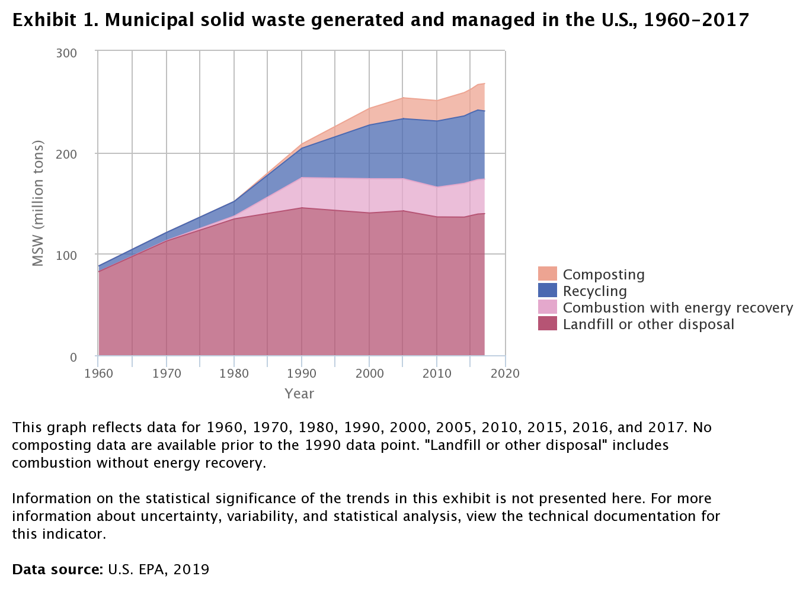
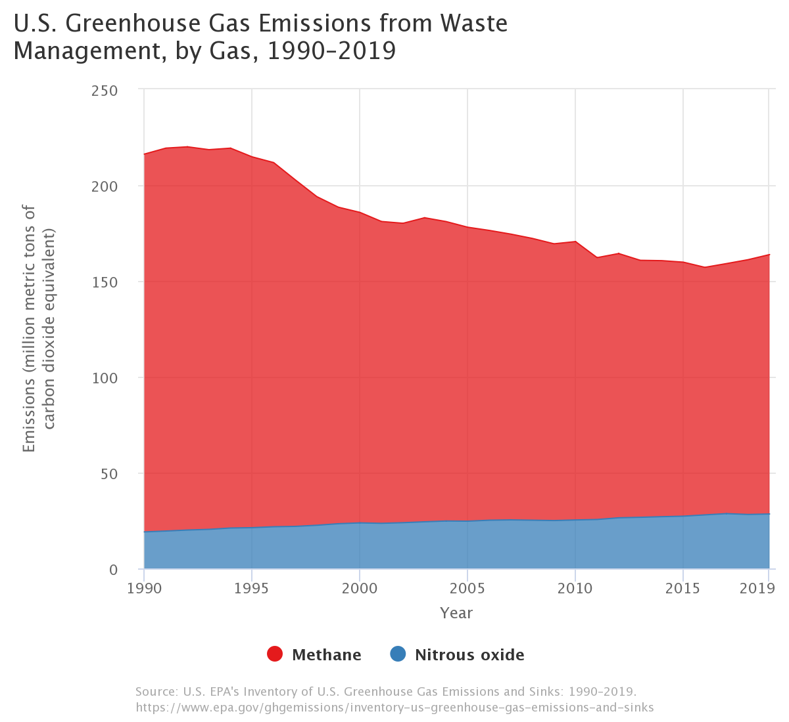

# Characterizing the (Great) Problem

Different types of waste introduce different problems into it's surrounding environment. For example, hazardous waste is classified as being specifically toxic to humans and without careful treatment, it can negatively impact human or environmental health. In contrast, electronic waste (e-waste) . . .

## Municipal Solid Waste (aka Trash)
Municipal Solid Waste, according to the US Environmental Protection Agency (EPA), is defined as:
> *Waste from homes, institutions, and commercial sources consisting of everyday items such as product packaging, grass clippings, furniture, clothing, bottles and cans, food scraps, newspapers, appliances, consumer electronics, and batteries.*

Basically everything under the colloquial "trash" term. The EPA provides time series data on the quantity of trash produced in the US since 1960.

An interactive version of the plot can be found [here](https://cfpub.epa.gov/roe/indicator.cfm?i=53#e). Note that the plot is a bit misleading since each category of MSW waste is summed on top of each other - i.e. there was 67.8 million tons of recycling in 2017 and 139.59 million tons of landfill or other disposal, as opposed to more recycling than landfill waste.

The EPA annually releases the Inventory of the U.S. Greenhouse Gas Emissions and Sinks, and provides a [data explorer](https://cfpub.epa.gov/ghgdata/inventoryexplorer/index.html) tool to examine the emissions by sector.

Interactive plot found [here](https://cfpub.epa.gov/ghgdata/inventoryexplorer/#waste/entiresector/allgas/category/all).

Interactive plot found [here](https://cfpub.epa.gov/ghgdata/inventoryexplorer/#waste/entiresector/allgas/gas/all).

In 2019, the total US methane emission was 659.71 MMT CO2 (million metric tons of carbon dioxide equivalent), while the methane emissions from waste alone were at 135.35 MMT CO2. Therefore, waste management (mostly 'landfill and other disposal' methods) accounted for about **21% of all methane emission in 2019**. This is a rather sizable contribution. 
